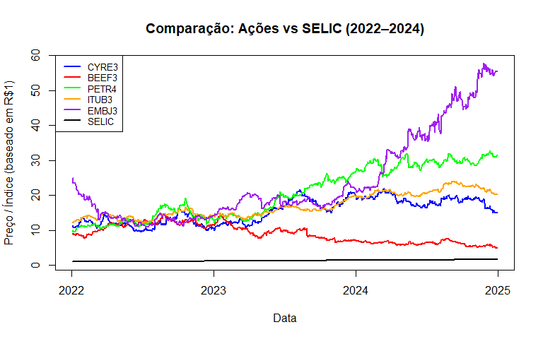
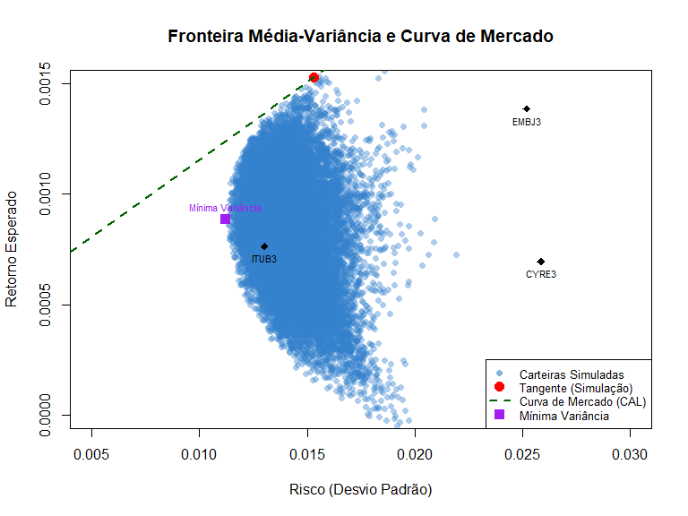
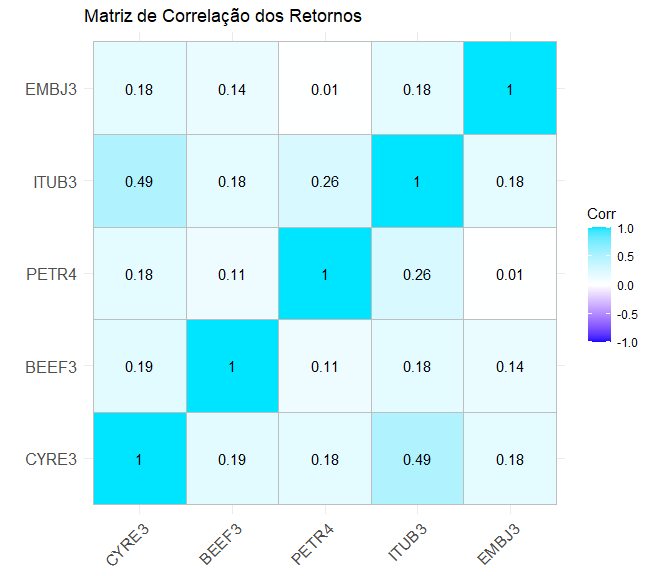

Fronteira Eficiente, Carteira Tangente e CAPM - B3 (2022-2024)
================
2026-07-24

## Introdução

Projeto de ciência de dados aplicado ao mercado financeiro, cobrindo coleta
de dados via API, análise exploratória, modelagem estatística (regressão) e
visualização de dados.

Este relatório baixa cotações de cinco ativos negociados na B3, calcula
estatísticas descritivas, monta a fronteira média-variância por
simulação de Monte Carlo, encontra a carteira tangente (analítica) e a
carteira de mínima variância, e estima o beta (CAPM) de cada ativo em
relação à carteira tangente.

Ativos analisados: CYRE3 (Cyrela), BEEF3 (Minerva), PETR4 (Petrobras),
ITUB3 (Itaú) e EMBJ3 (Embraer). Período: 01/01/2022 a 31/12/2024. A
SELIC diária (série 432 do Banco Central) é usada como ativo livre de
risco.

## Pacotes

``` r
library(quantmod)
```

    ## Warning: pacote 'quantmod' foi compilado no R versão 4.5.3

    ## Warning: pacote 'xts' foi compilado no R versão 4.5.3

    ## Warning: pacote 'zoo' foi compilado no R versão 4.5.3

    ## Warning: pacote 'TTR' foi compilado no R versão 4.5.3

``` r
library(yfR)
```

    ## Warning: pacote 'yfR' foi compilado no R versão 4.5.3

``` r
library(xts)
library(tidyverse)
```

    ## Warning: pacote 'tidyverse' foi compilado no R versão 4.5.3

    ## Warning: pacote 'readr' foi compilado no R versão 4.5.3

    ## Warning: pacote 'dplyr' foi compilado no R versão 4.5.3

    ## Warning: pacote 'lubridate' foi compilado no R versão 4.5.3

``` r
library(corrplot)
```

    ## Warning: pacote 'corrplot' foi compilado no R versão 4.5.3

``` r
library(ggcorrplot)
```

    ## Warning: pacote 'ggcorrplot' foi compilado no R versão 4.5.3

``` r
library(jsonlite)
```

    ## Warning: pacote 'jsonlite' foi compilado no R versão 4.5.3

## Dados: cotações das ações

Tickers da B3 mudam com o tempo (ex.: EMBR3 -\> EMBJ3 em nov/2025, JBSS3
saiu de listagem em jun/2025). Se algum `getSymbols()` abaixo falhar com
erro 404, confira se o ticker ainda está ativo no Yahoo Finance.

``` r
data_inicio <- "2022-01-01"
data_fim <- "2024-12-31"

getSymbols("CYRE3.SA", from = data_inicio, to = data_fim)  # Cyrela
```

    ## [1] "CYRE3.SA"

``` r
getSymbols("BEEF3.SA", from = data_inicio, to = data_fim)  # Minerva
```

    ## [1] "BEEF3.SA"

``` r
getSymbols("PETR4.SA", from = data_inicio, to = data_fim)  # Petrobras
```

    ## [1] "PETR4.SA"

``` r
getSymbols("ITUB3.SA", from = data_inicio, to = data_fim)  # Itaú
```

    ## [1] "ITUB3.SA"

``` r
getSymbols("EMBJ3.SA", from = data_inicio, to = data_fim)  # Embraer
```

    ## [1] "EMBJ3.SA"

``` r
# Extraindo as cotações ajustadas
CYRE <- CYRE3.SA[, "CYRE3.SA.Adjusted"]
BEEF <- BEEF3.SA[, "BEEF3.SA.Adjusted"]
PETR <- PETR4.SA[, "PETR4.SA.Adjusted"]
ITUB <- ITUB3.SA[, "ITUB3.SA.Adjusted"]
EMBJ <- EMBJ3.SA[, "EMBJ3.SA.Adjusted"]

# Juntar os dados em um único objeto xts para tabelar
dados <- merge(CYRE, BEEF, join = "inner")
dados <- merge(dados, PETR, join = "inner")
dados <- merge(dados, ITUB, join = "inner")
dados <- merge(dados, EMBJ, join = "inner")
colnames(dados) <- c("CYRE3", "BEEF3", "PETR4", "ITUB3", "EMBJ3")

head(dados)
```

    ##               CYRE3    BEEF3     PETR4    ITUB3    EMBJ3
    ## 2022-01-03 11.41656 9.224223  9.967373 12.15328 24.91539
    ## 2022-01-04 11.21213 9.003335 10.005063 12.42294 24.89565
    ## 2022-01-05 10.92122 8.897309  9.617881 12.17209 23.41494
    ## 2022-01-06 10.82686 8.888475  9.611028 12.39158 23.56301
    ## 2022-01-07 10.97625 8.764779  9.655574 12.58599 23.76044
    ## 2022-01-10 10.75610 8.658752  9.597325 12.65496 23.43468

## Dados: SELIC (ativo livre de risco)

A SELIC efetiva diária (código 432) é baixada direto da API do SGS/Banco
Central, sem depender de nenhum pacote específico de dados do BCB.

``` r
url_selic <- paste0(
  "https://api.bcb.gov.br/dados/serie/bcdata.sgs.432/dados?",
  "formato=json&dataInicial=", format(as.Date(data_inicio), "%d/%m/%Y"),
  "&dataFinal=", format(as.Date(data_fim), "%d/%m/%Y")
)

selic_df <- fromJSON(url_selic)
selic_df$data <- as.Date(selic_df$data, format = "%d/%m/%Y")
selic_df$valor <- as.numeric(selic_df$valor)

# Converte a série para xts
selic_xts <- xts(selic_df$valor, order.by = selic_df$data)

# Converte SELIC anual para taxa equivalente diária (base 252 dias úteis)
selic_diaria <- (1 + selic_xts / 100)^(1 / 252) - 1

# Converte para SELIC diária acumulada, como se fosse um ativo de renda fixa
selic_acumulada <- cumprod(1 + selic_diaria)
colnames(selic_acumulada) <- "SELIC"

# Alinha datas com os dados de preços ajustados
selic_plot <- selic_acumulada[index(dados)]
dados_com_selic <- merge(dados, selic_plot, join = "inner")

head(selic_diaria)
```

    ##                    [,1]
    ## 2022-01-01 0.0003511277
    ## 2022-01-02 0.0003511277
    ## 2022-01-03 0.0003511277
    ## 2022-01-04 0.0003511277
    ## 2022-01-05 0.0003511277
    ## 2022-01-06 0.0003511277

## Gráfico: ações vs. SELIC

``` r
plot.zoo(dados_com_selic, plot.type = "single",
         col = c("blue", "red", "green", "orange", "purple", "black"),
         lwd = 2, xlab = "Data", ylab = "Preço / Índice (baseado em R$1)",
         main = "Comparação: Ações vs SELIC (2022–2024)")

legend("topleft", legend = c("CYRE3", "BEEF3", "PETR4", "ITUB3", "EMBJ3", "SELIC"),
       col = c("blue", "red", "green", "orange", "purple", "black"),
       lty = 1, lwd = 2, cex = 0.8)
```

<!-- -->

## Retornos diários

``` r
ret_CYRE <- dailyReturn(CYRE)
ret_BEEF <- dailyReturn(BEEF)
ret_PETR <- dailyReturn(PETR)
ret_ITUB <- dailyReturn(ITUB)
ret_EMBJ <- dailyReturn(EMBJ)

# Junta os retornos diários dos ativos em um mesmo objeto, na mesma ordem
# usada em colnames() logo abaixo
retornos <- merge(ret_CYRE, ret_BEEF, join = "inner")
retornos <- merge(retornos, ret_PETR, join = "inner")
retornos <- merge(retornos, ret_ITUB, join = "inner")
retornos <- merge(retornos, ret_EMBJ, join = "inner")
colnames(retornos) <- c("CYRE3", "BEEF3", "PETR4", "ITUB3", "EMBJ3")

head(retornos)
```

    ##                   CYRE3         BEEF3         PETR4        ITUB3         EMBJ3
    ## 2022-01-03  0.000000000  0.0000000000  0.0000000000  0.000000000  0.0000000000
    ## 2022-01-04 -0.017906491 -0.0239465302  0.0037813537  0.022188091 -0.0007924003
    ## 2022-01-05 -0.025946661 -0.0117762691 -0.0386986302 -0.020192002 -0.0594766930
    ## 2022-01-06 -0.008639311 -0.0009928715 -0.0007125378  0.018031764  0.0063237954
    ## 2022-01-07  0.013798107 -0.0139164841  0.0046348974  0.015688599  0.0083787957
    ## 2022-01-10 -0.020057282 -0.0120968992 -0.0060326316  0.005480338 -0.0137100181

## Estatísticas descritivas

``` r
estatisticas <- function(x) {
  c(
    Média = mean(x),
    Mediana = median(x),
    Desvio_Padrão = sd(x),
    Mínimo = min(x),
    Máximo = max(x)
  )
}

# Estatísticas para preços ajustados
estat_preco <- data.frame(
  CYRE3 = estatisticas(as.numeric(CYRE)),
  BEEF3 = estatisticas(as.numeric(BEEF)),
  PETR4 = estatisticas(as.numeric(PETR)),
  ITUB3 = estatisticas(as.numeric(ITUB)),
  EMBJ3 = estatisticas(as.numeric(EMBJ))
)

# Estatísticas para retornos diários
estat_retorno <- data.frame(
  CYRE3 = estatisticas(as.numeric(ret_CYRE)),
  BEEF3 = estatisticas(as.numeric(ret_BEEF)),
  PETR4 = estatisticas(as.numeric(ret_PETR)),
  ITUB3 = estatisticas(as.numeric(ret_ITUB)),
  EMBJ3 = estatisticas(as.numeric(ret_EMBJ))
)

print("Estatísticas Descritivas - Preços Ajustados")
```

    ## [1] "Estatísticas Descritivas - Preços Ajustados"

``` r
print(estat_preco)
```

    ##                   CYRE3     BEEF3     PETR4     ITUB3    EMBJ3
    ## Média         15.471753  9.038062 20.475966 17.011555 23.80395
    ## Mediana       16.073875  8.764779 19.524336 15.828982 18.77539
    ## Desvio_Padrão  3.472972  2.577591  7.333808  3.397847 12.51164
    ## Mínimo         9.536457  4.911928  9.597325 12.126286 10.73020
    ## Máximo        21.878168 14.715403 32.743378 24.014141 57.73777

``` r
print("Estatísticas Descritivas - Retornos Diários")
```

    ## [1] "Estatísticas Descritivas - Retornos Diários"

``` r
print(estat_retorno)
```

    ##                       CYRE3         BEEF3        PETR4         ITUB3
    ## Média          0.0006948214 -0.0005096316  0.001761379  0.0007635868
    ## Mediana       -0.0004366827 -0.0009928715  0.001366700  0.0004179607
    ## Desvio_Padrão  0.0258657314  0.0255821699  0.021096875  0.0130118113
    ## Mínimo        -0.1173053281 -0.1825688133 -0.091993720 -0.0509632317
    ## Máximo         0.1141791359  0.1048797916  0.079865683  0.0654732013
    ##                       EMBJ3
    ## Média          0.0013867846
    ## Mediana        0.0006222833
    ## Desvio_Padrão  0.0251889599
    ## Mínimo        -0.1492717617
    ## Máximo         0.1020638633

## Índice de Sharpe por ativo

``` r
# Alinhar a SELIC com as datas dos retornos
selic_alinhada_CYRE <- selic_diaria[index(ret_CYRE)]
selic_alinhada_BEEF <- selic_diaria[index(ret_BEEF)]
selic_alinhada_PETR <- selic_diaria[index(ret_PETR)]
selic_alinhada_ITUB <- selic_diaria[index(ret_ITUB)]
selic_alinhada_EMBJ <- selic_diaria[index(ret_EMBJ)]

# Cálculo do Sharpe de cada ativo
media_ret_CYRE <- mean(ret_CYRE, na.rm = TRUE)
media_selic_CYRE <- mean(selic_alinhada_CYRE, na.rm = TRUE)
desvio_CYRE <- sd(ret_CYRE, na.rm = TRUE)
sharpe_CYRE <- (media_ret_CYRE - media_selic_CYRE) / desvio_CYRE

media_ret_BEEF <- mean(ret_BEEF, na.rm = TRUE)
media_selic_BEEF <- mean(selic_alinhada_BEEF, na.rm = TRUE)
desvio_BEEF <- sd(ret_BEEF, na.rm = TRUE)
sharpe_BEEF <- (media_ret_BEEF - media_selic_BEEF) / desvio_BEEF

media_ret_PETR <- mean(ret_PETR, na.rm = TRUE)
media_selic_PETR <- mean(selic_alinhada_PETR, na.rm = TRUE)
desvio_PETR <- sd(ret_PETR, na.rm = TRUE)
sharpe_PETR <- (media_ret_PETR - media_selic_PETR) / desvio_PETR

media_ret_ITUB <- mean(ret_ITUB, na.rm = TRUE)
media_selic_ITUB <- mean(selic_alinhada_ITUB, na.rm = TRUE)
desvio_ITUB <- sd(ret_ITUB, na.rm = TRUE)
sharpe_ITUB <- (media_ret_ITUB - media_selic_ITUB) / desvio_ITUB

media_ret_EMBJ <- mean(ret_EMBJ, na.rm = TRUE)
media_selic_EMBJ <- mean(selic_alinhada_EMBJ, na.rm = TRUE)
desvio_EMBJ <- sd(ret_EMBJ, na.rm = TRUE)
sharpe_EMBJ <- (media_ret_EMBJ - media_selic_EMBJ) / desvio_EMBJ

data.frame(
  Ativo = c("CYRE3", "BEEF3", "PETR4", "ITUB3", "EMBJ3"),
  Sharpe = c(sharpe_CYRE, sharpe_BEEF, sharpe_PETR, sharpe_ITUB, sharpe_EMBJ)
)
```

    ##   Ativo       Sharpe
    ## 1 CYRE3  0.009132349
    ## 2 BEEF3 -0.037848163
    ## 3 PETR4  0.061751932
    ## 4 ITUB3  0.023438723
    ## 5 EMBJ3  0.036848607

## Matriz de correlação dos retornos

``` r
matriz_correlacao <- cor(retornos, use = "complete.obs")
print(round(matriz_correlacao, 3))
```

    ##       CYRE3 BEEF3 PETR4 ITUB3 EMBJ3
    ## CYRE3 1.000 0.190 0.179 0.486 0.184
    ## BEEF3 0.190 1.000 0.114 0.179 0.139
    ## PETR4 0.179 0.114 1.000 0.260 0.008
    ## ITUB3 0.486 0.179 0.260 1.000 0.179
    ## EMBJ3 0.184 0.139 0.008 0.179 1.000

## Carteira tangente (analítica) e carteira de mínima variância

A carteira tangente é calculada por fórmula fechada, maximizando o
índice de Sharpe. **Essa fórmula não restringe os pesos a serem
não-negativos** — ou seja, permite venda a descoberto (short selling).
Para uma carteira “long only”, seria necessário otimizar com restrições
(ex.: pacote `quadprog`).

``` r
selic_alinhada <- selic_diaria[index(retornos)]
retornos_excesso <- sweep(retornos, 1, selic_alinhada, "-")
retornos_medios_excesso <- colMeans(retornos_excesso, na.rm = TRUE)
cov_matrix <- cov(retornos, use = "complete.obs")

# Pesos ótimos da carteira tangente
w_tangente <- solve(cov_matrix) %*% retornos_medios_excesso
w_tangente <- w_tangente / sum(w_tangente)

# Retorno, risco e Sharpe da carteira tangente
ret_tangente <- as.numeric(t(w_tangente) %*% colMeans(retornos, na.rm = TRUE))
risco_tangente <- sqrt(as.numeric(t(w_tangente) %*% cov_matrix %*% w_tangente))
rf <- mean(selic_alinhada, na.rm = TRUE)
sharpe_tangente <- (ret_tangente - rf) / risco_tangente

print("Pesos da carteira tangente (analítica):")
```

    ## [1] "Pesos da carteira tangente (analítica):"

``` r
print(round(w_tangente, 4))
```

    ##          [,1]
    ## CYRE3 -0.0681
    ## BEEF3 -0.6030
    ## PETR4  0.9199
    ## ITUB3  0.2491
    ## EMBJ3  0.5021

``` r
cat("Retorno esperado da tangente:", round(ret_tangente, 5), "\n")
```

    ## Retorno esperado da tangente: 0.00277

``` r
cat("Risco da tangente:", round(risco_tangente, 5), "\n")
```

    ## Risco da tangente: 0.02613

``` r
cat("Índice de Sharpe da tangente:", round(sharpe_tangente, 5), "\n")
```

    ## Índice de Sharpe da tangente: 0.08833

``` r
# Série de retorno diário da carteira tangente, usada mais adiante nos betas
ret_carteira_tangente <- xts(
  rowSums(sweep(retornos, 2, as.numeric(w_tangente), `*`)),
  order.by = index(retornos)
)

# Carteira de mínima variância (GMV)
ones <- rep(1, ncol(retornos))
w_gmv <- solve(cov_matrix) %*% ones
w_gmv <- w_gmv / sum(w_gmv)

ret_gmv <- as.numeric(t(w_gmv) %*% colMeans(retornos, na.rm = TRUE))
risco_gmv <- sqrt(as.numeric(t(w_gmv) %*% cov_matrix %*% w_gmv))

print("Pesos da carteira de mínima variância:")
```

    ## [1] "Pesos da carteira de mínima variância:"

``` r
print(round(w_gmv, 4))
```

    ##          [,1]
    ## CYRE3 -0.0323
    ## BEEF3  0.1079
    ## PETR4  0.1749
    ## ITUB3  0.6184
    ## EMBJ3  0.1311

## Fronteira média-variância (simulação de Monte Carlo)

``` r
n_sim <- 30000
set.seed(42)  # garante que a simulação seja reprodutível
pesos <- matrix(runif(n_sim * 5), ncol = 5)
pesos <- pesos / rowSums(pesos)

retornos_medios <- colMeans(retornos, na.rm = TRUE)
retorno_port <- pesos %*% retornos_medios
risco_port <- apply(pesos, 1, function(w) sqrt(t(w) %*% cov_matrix %*% w))

rf <- mean(selic_alinhada, na.rm = TRUE)
sharpe <- (retorno_port - rf) / risco_port
idx_max_sharpe <- which.max(sharpe)

plot(risco_port, retorno_port, col = rgb(0.2, 0.5, 0.8, 0.4), pch = 16,
     xlab = "Risco (Desvio Padrão)", ylab = "Retorno Esperado",
     main = "Fronteira Média-Variância e Curva de Mercado",
     xlim = c(0.005, 0.03),
     ylim = c(0, 0.0015))

points(risco_port[idx_max_sharpe], retorno_port[idx_max_sharpe], col = "red", pch = 19, cex = 1.5)
abline(a = rf, b = sharpe[idx_max_sharpe], col = "darkgreen", lwd = 2, lty = 2)
points(risco_gmv, ret_gmv, col = "purple", pch = 15, cex = 1.5)
text(risco_gmv, ret_gmv, labels = "Mínima Variância", pos = 3, col = "purple", cex = 0.7)

retornos_medios_individuais <- colMeans(retornos, na.rm = TRUE)
riscos_individuais <- apply(retornos, 2, sd, na.rm = TRUE)
points(riscos_individuais, retornos_medios_individuais, col = "black", pch = 18, cex = 1.2)
text(riscos_individuais, retornos_medios_individuais,
     labels = names(retornos), pos = 1, cex = 0.7, col = "black")

legend("bottomright",
       legend = c("Carteiras Simuladas", "Tangente (Simulação)", "Curva de Mercado (CAL)", "Mínima Variância"),
       col = c(rgb(0.2, 0.5, 0.8, 0.6), "red", "darkgreen", "purple"),
       pch = c(16, 19, NA, 15), lty = c(NA, NA, 2, NA),
       pt.cex = c(1, 1.5, NA, 1.5), lwd = c(NA, NA, 2, NA),
       cex = 0.8)
```

<!-- -->

## Betas (CAPM)

O beta de cada ativo é estimado por regressão linear do excesso de
retorno do ativo contra o excesso de retorno da carteira tangente.

``` r
ret_excesso_tangente <- ret_carteira_tangente - selic_diaria[index(ret_carteira_tangente)]

# O merge explícito abaixo garante que ret_ativo e ret_mercado fiquem
# alinhados por data antes da regressão
calcular_beta <- function(ret_ativo, ret_mercado) {
  excesso_ativo <- ret_ativo - selic_diaria[index(ret_ativo)]
  dados_reg <- merge(excesso_ativo, ret_mercado, join = "inner")
  colnames(dados_reg) <- c("excesso_ativo", "excesso_mercado")
  modelo <- lm(excesso_ativo ~ excesso_mercado, data = dados_reg)
  coef(modelo)[2]
}

beta_BEEF <- calcular_beta(ret_BEEF, ret_excesso_tangente)
beta_CYRE <- calcular_beta(ret_CYRE, ret_excesso_tangente)
beta_PETR <- calcular_beta(ret_PETR, ret_excesso_tangente)
beta_ITUB <- calcular_beta(ret_ITUB, ret_excesso_tangente)
beta_EMBJ <- calcular_beta(ret_EMBJ, ret_excesso_tangente)

data.frame(
  Ativo = c("CYRE3", "BEEF3", "PETR4", "ITUB3", "EMBJ3"),
  Beta = round(c(beta_CYRE, beta_BEEF, beta_PETR, beta_ITUB, beta_EMBJ), 4)
)
```

    ##   Ativo    Beta
    ## 1 CYRE3  0.1023
    ## 2 BEEF3 -0.4196
    ## 3 PETR4  0.5644
    ## 4 ITUB3  0.1321
    ## 5 EMBJ3  0.4021

## Heatmap de correlação

``` r
cor_matrix <- cor(retornos, use = "pairwise.complete.obs")

ggcorrplot(cor_matrix, method = "square", type = "full", lab = TRUE,
           colors = c("blue", "white", "#00E5FF"),
           title = "Matriz de Correlação dos Retornos",
           ggtheme = ggplot2::theme_minimal())
```

<!-- -->

## Limitações conhecidas

- A carteira tangente permite pesos negativos (short selling), como
  observado acima.
- Os tickers da B3 mudam com o tempo — vale verificar se os tickers
  usados ainda estão ativos.
- Uso de 252 dias úteis/ano como aproximação para converter a SELIC
  anual em taxa diária equivalente.
